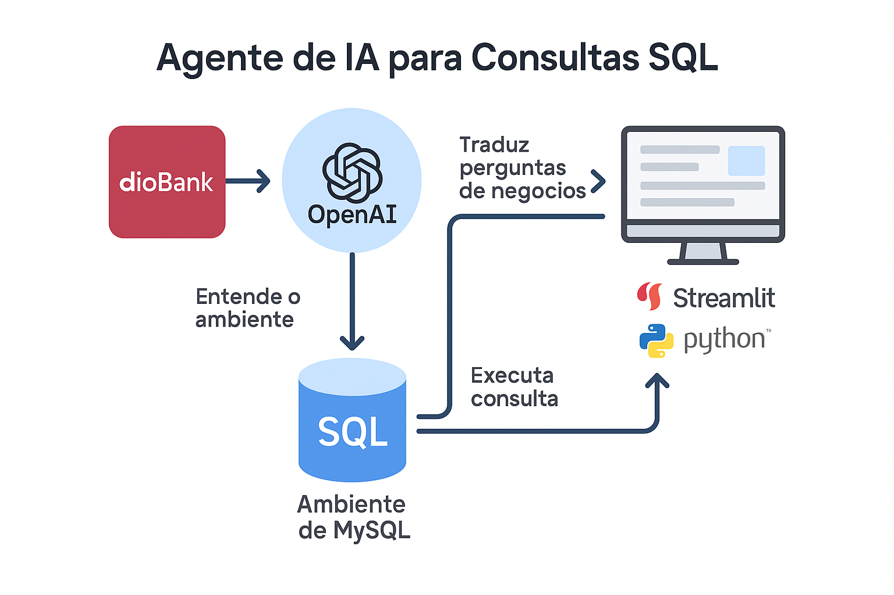

<h1 align="center">


<h3> <p align="center">Agente de Consulta SQL -  DIOBANK </p> </h3>
<h3> <p align="center"> ================= </p> </h3>


## **Visão Geral do Projeto**

Nesta aula vamos propor uma visão geral sobre o papel do agente de IA, e como ele pode ajudar na manipulação e insigths em consultas de SQL.
Para tanto foi necessário construir um banco de dados MYSQL localhost e construir um dataset ficticio, que neste cenário, chama-se Dio Bank.

## **Arquitetura do projeto**



## **Pré-requisitos**

1. Tenha um banco de dados MYSQL instalado em sua máquina (na pasta ```banco_de_dados``` existem dois arquivos em raiz,  ```instalar_mysql_mac.sh``` e ```instalador_windows.txt``` para quem não possui instalado localmente, possa instalar tranquilamente.)
2. Instale um ambiente virtual python utilizando o arquivo na raiz ```env_install.sh```
3. Instale as depedencias via pip install -r requirements.txt
4. Configure as credencias do seu banco de dados em .env
5. Insira os dados em seu banco MYSQL a partir do script localizado em <b> banco_de_dados/scripts/create_table.py
6. Rode os scripts pythons localizados na pasta agente.

