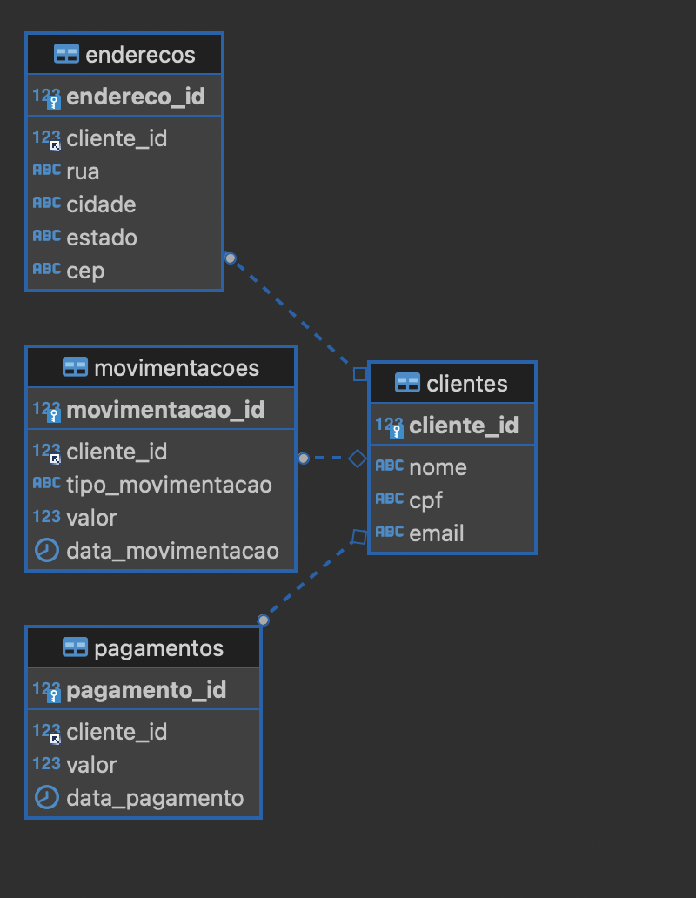

<h1 align="center">


<h3> <p align="center">Massa de Dados Fictícia - DIOBANK </p> </h3>
<h3> <p align="center"> ================= </p> </h3>


## **Visão Geral do Projeto**

Neste segmento, criamos um script capaz de gerar uma massa de dados fictícia do banco ficiticio DioBank. O propósito é gerar arquivos relacionados emm CSV e também em ingestar em um banco de dados MYSQL configurado localmente. Este script foi desenvolvida como parte de um curso prático na plataforma DIO.me (https://www.dio.me/pt). O projeto é uma simulação de um banco financeiro, onde você irá interagir com um banco de dados MySQL utilizando comandos SQL.


## **Pré-requisitos**

1. Instale os pacotes do requirements.txt
2. Instale e ative um banco de dados MySQL em seu computador pessoal. 
3. Configure as credenciais de acesso no arquivo .env

### **Objetivo do Projeto**

O foco deste projeto é gerar, manipular e consultar dados fictícios que simulam as operações de um banco. Ele foi desenvolvido como parte do curso de "Agentes de IA para Consultas SQL", onde os alunos terão a oportunidade de entender como funcionam as consultas em bancos de dados relacionais, utilizando o MySQL para gerir uma base de dados de clientes, endereços, pagamentos e movimentações financeiras.

## **Estrutura do Projeto**

Este projeto está estruturado em torno de um banco de dados fictício, contendo as seguintes entidades principais:

1. **Clientes** – Tabela que armazena informações sobre os clientes do banco, como nome, CPF e e-mail.
2. **Endereços** – Relaciona os clientes aos seus endereços físicos, com dados como rua, cidade, estado e CEP.
3. **Movimentações Bancárias** – Tabela que registra as movimentações financeiras dos clientes (saques, depósitos, transferências).
4. **Pagamentos** – Registra os pagamentos realizados pelos clientes, com informações sobre o valor e a data de pagamento.

### **Relacionamentos entre as Tabelas**



As tabelas possuem as seguintes relações:
- **Clientes ↔ Endereços**: A tabela de endereços é ligada à tabela de clientes através do campo `cliente_id`.
- **Clientes ↔ Movimentações Bancárias**: A tabela de movimentações também está relacionada com a tabela de clientes, através do campo `cliente_id`, representando as movimentações financeiras dos clientes.
- **Clientes ↔ Pagamentos**: A tabela de pagamentos está relacionada à tabela de clientes, com o campo `cliente_id` representando os pagamentos realizados pelos clientes.

Essas tabelas são interconectadas por **chaves estrangeiras** que garantem a integridade referencial dos dados, facilitando a realização de **joins** nas consultas SQL.

## **Exemplo de Estrutura das Tabelas**

```sql
CREATE TABLE clientes (
    cliente_id INT AUTO_INCREMENT PRIMARY KEY,
    nome VARCHAR(100),
    cpf VARCHAR(11),
    email VARCHAR(100)
);

CREATE TABLE enderecos (
    endereco_id INT AUTO_INCREMENT PRIMARY KEY,
    cliente_id INT,
    rua VARCHAR(255),
    cidade VARCHAR(100),
    estado VARCHAR(50),
    cep VARCHAR(8),
    FOREIGN KEY (cliente_id) REFERENCES clientes(cliente_id)
);

CREATE TABLE movimentacoes (
    movimentacao_id INT AUTO_INCREMENT PRIMARY KEY,
    cliente_id INT,
    tipo_movimentacao VARCHAR(50),
    valor DECIMAL(10, 2),
    data_movimentacao DATE,
    FOREIGN KEY (cliente_id) REFERENCES clientes(cliente_id)
);

CREATE TABLE pagamentos (
    pagamento_id INT AUTO_INCREMENT PRIMARY KEY,
    cliente_id INT,
    valor DECIMAL(10, 2),
    data_pagamento DATE,
    FOREIGN KEY (cliente_id) REFERENCES clientes(cliente_id)
);